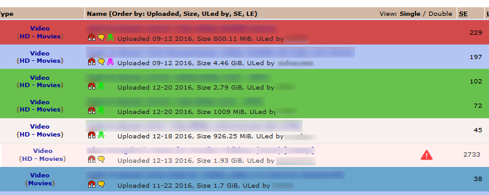

# Installation

** ALSO AVAILABLE AS A WEBEXTENSION FOR FIREFOX **  
https://addons.mozilla.org/firefox/addon/the-pirate-bay-tweaks/

1. If you don't already have a script manager installed:   
For Firefox install [Greasemonkey](https://addons.mozilla.org/firefox/addon/greasemonkey/), and for Chrome install [Tampermonkey](https://chrome.google.com/webstore/detail/tampermonkey/dhdgffkkebhmkfjojejmpbldmpobfkfo). 
2. Click on the filename (The_Pirate_Bay_Tweaks.user.js), wait for the new page to load, then click on the **Raw** button.
3. Your script manager will ask for permission to install the script.

# Usage

** HOW TO USE WITH **FIREFOX** + **GREASEMONKEY** **

After you first install the script, a `the_pirate_bay_tweaks_prefs.txt` file **should** be downloaded and placed in the same folder as the userscript. This file contains a basic template which you can expand on, and prefs which can be toggled on `true` or off `false`.  

In the case of it **not** being downloaded, you can simply download [this file](https://raw.githubusercontent.com/LeLobster/userscripts/master/The_Pirate_Bay_Tweaks/the_pirate_bay_tweaks_prefs.txt) from the repo and place it in the folder next to the `The_Pirate_Bay_Tweaks.user.js` file.  

The folder can be found in different places depending on your operating system.  

WINDOWS  
* `C:\Users\<Windows login/user name>\AppData\Roaming\Mozilla\Firefox\Profiles\<profile folder>\gm_scripts\The_Pirate_Bay_Tweaks`  

LINUX  
* `~/.mozilla/firefox/<profile folder>/gm_scripts/The_Pirate_Bay_Tweaks/`  

MAC  
* `~/Library/Application Support/Firefox/Profiles/<profile folder>/gm_scripts/The_Pirate_Bay_Tweaks/`  
or
* `~/Library/Mozilla/Firefox/Profiles/<profile folder>/gm_scripts/The_Pirate_Bay_Tweaks/`

After you've found the folder you can simply open the `the_pirate_bay_tweaks_prefs.txt` file with your text editor of choice.

** HOW TO USE WITH **CHROME** + **TAMPERMONKEY** **

Because Tampermonkey handles required local files differently compared to Greasemonkey, a couple additional steps need to be done for you to be able to edit the `the_pirate_bay_tweaks_prefs.txt` file.  
First download [this file](https://raw.githubusercontent.com/LeLobster/userscripts/master/The_Pirate_Bay_Tweaks/the_pirate_bay_tweaks_prefs.txt) and place it whereever you want (I recommend the Chrome install folder so it's easy to keep track of the file.)   
Next open the file in your browser by dragging the .txt file into it. In the url bar this will reveal the `file:///` path of your file which is needed later. (This looks like `file:///<drive>/<folders>/The_Pirate_Bay_Tweaks/the_pirate_bay_tweaks_prefs.txt`  
Next go into your Chrome extensions settings `chrome://extensions/` and toggle the Tampermonkey checkbox for `Allow acces to file urls`   
Open the Tampermonkey Dashboard and click on this script to edit it.  
Locate the `// @require` tag, it can be found at the bottom of the userscript metadata block (ending with `// ==/UserScript==`), 
replace `the_pirate_bay_tweaks_prefs.txt` with the full `file:///` path of the .txt file and click the 'floppy disk' icon to save your changes.  

Now you can go to the original location where you downloaded the `the_pirate_bay_tweaks_prefs.txt` and open it with your text editor of choice.

# the_pirate_bay_tweaks_prefs.txt

Pref names are very descriptive so they shouldn't require further explanation.
* Booleans can be either true or false
* Colors can be specified by their name `"red"`, HEX value `"#FF0000"` or RGB(a) value `"rgb(255, 0, 0)"`
* Arrays `[]` contain multiple values enclosed in quotes `"` and seperated by a comma `, `

`GoodKeyword`, `OtherKeyword`, `NonRetailKeyword` and `UnwantedKeyword` are case-insensitive.  
`GoodUploader` and `UnwantedUploader` are case-sensitive.

By default (as can be seen in the screenshot at the top of this page) red is used for torrents which contain `UnwantedKeyword`  
Lightblue is for torrents which are `OtherKeyword`, default = web-dl related.  
Darker lightblue is for torrents which use the x265(HEVC) encoding library.  
Green is for torrents which are by your favorite uploaders or contain a keyword specified in `GoodKeyword`.  
And torrents which could potentially be a fake are marked with the `warning.png` triangle.  

This can all be changed or completely disabled inside the `the_pirate_bay_tweaks_prefs` file. If you want to hide x265 encodes simply set `hidex265InsteadOfHighlight` to `true`, if you don't want to highlight web-dl related releases toggle `affectOther` to `false` etc. etc.

Fake torrents are often by untrusted accounts, and have huge amounts of S/L shorty after they are posted. To help against this you can use `maxSeedsWithoutTrust`, any torrent which exceeds this value in seeders will be marked fake (or completely hidden if you want). Obviously there is a chance of false positives using this method but it's better than nothing.

There are a couple other things you can set in `the_pirate_bay_tweaks_prefs` so have a look and you'll be able to figure out what they're for.

**ALTERNATIVE**  
This same script can be found on Greasyfork as well  
https://greasyfork.org/en/scripts/27293-the-pirate-bay-tweaks

# Help

I've tested with Greasemonkey on Firefox, and with Tampermonkey on Chrome. I didn't encounter any problem but if YOU do run into something please let me know by opening a new Issue.
